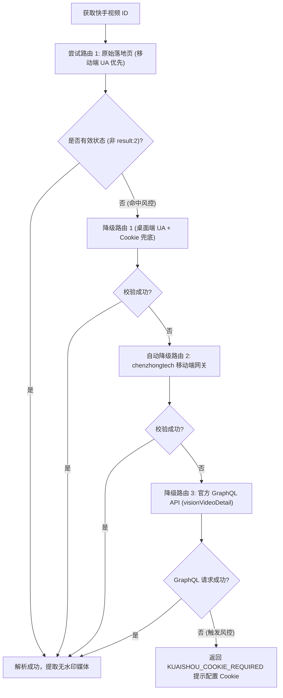

# 快手 (Kuaishou) 逆向解析指南

本篇详细记录快手短视频、图文图集（ATLAS）的多路由容灾抓取机制、GraphQL 接口降级与防风控策略。

---

## 1. 平台特征与支持能力

* **平台标识**：`快手`
* **支持媒体类型**：
  * 无水印高清短视频 (MP4 / DASH 媒体流)
  * 高清图文图集 (ATLAS 原图 / WebP 图集)
  * 背景音乐音频 (Audio)
* **常见链接形态**：
  * App 短链：`https://v.kuaishou.com/xxxx`
  * 移动端 H5 落地页：`https://v.m.chenzhongtech.com/fw/photo/3xbr5pi8hxi4e6s`（含 `*.m.chenzhongtech.com` 随机子域名）
  * PC 网页长链：`https://www.kuaishou.com/short-video/3xbr5pi8hxi4e6s`
* **Cookie 依赖与配置**：
  * 支持免 Cookie 匿名多路由探测与 GraphQL 接口提取。
  * 若目标视频触发快手反爬校验（返回 `result: 2` 或 `ANTICRAWL_DEFAULT`），系统支持动态加载 `KUAISHOU_COOKIE` 凭证（可在 `configs/business_config.json` 的 `platform_cookies.kuaishou` 或环境变量 `KUAISHOU_COOKIE` 中配置）。
  * 触发风控且未配置有效 Cookie 时统一返回 `KUAISHOU_COOKIE_REQUIRED` 错误码。

---

## 2. 核心逆向方案：双端多路由 Fallback + GraphQL 降级容灾

快手不同公开路由的封控力度和可用性波动较大。在 [KuaishouParser](file:///Users/leo/Projects/media-parser/src/parsers/kuaishou_parser.py) 中，我们设计了**双端请求、多路由自适应降级重试与 GraphQL 兜底机制**：



### 2.1 候选路由构建 (`_candidate_urls`)
* 优先使用 302 重定向后的原生落地页（兼容快手随机生成的 `*.m.chenzhongtech.com` 泛子域名）。
* 备用使用移动端专用解析网关：`https://v.m.chenzhongtech.com/fw/photo/{video_id}`。
* PC 端直链：`https://www.kuaishou.com/short-video/{video_id}`。

### 2.2 GraphQL API 兜底通道 (`_try_graphql_api`)
* 请求网关：`https://www.kuaishou.com/graphql`
* 操作名：`visionVideoDetail`
* 查询字段：
  ```graphql
  query visionVideoDetail($photoId: String, $type: String, $page: String, $webPageArea: String) {
    visionVideoDetail(photoId: $photoId, type: $type, page: $page, webPageArea: $webPageArea) {
      status
      type
      author { id name headerUrl }
      photo {
        id caption coverUrl photoUrl
        mainMvUrls { url }
        manifest { adaptationSet { representation { url backupUrl } } }
        atlas { cdn cdnList list }
      }
    }
  }
  ```

### 2.3 风控识别与提示机制
* **风控特征识别**：快手反爬拦截会返回 `{"result": 2}` 或 `{"data": {"result": 400002, "bizName": "ANTICRAWL_DEFAULT"}}`。
* **熔断响应**：解析器标记 `cookie_required = True`，并在无有效 Cookie 导致无法解析时抛出 `KUAISHOU_COOKIE_REQUIRED` 错误，引导管理员更新快手 Cookie。

---

## 3. 数据提取与无水印保障

快手 CDN 视频流与图集资源为创作者原始上传的母带文件，不包含平台动态烧录的水印：

### 3.1 视频数据提取
* **标准字段 (`mainMvUrls` / `photoUrl`)**：
  * GraphQL 与 H5 载体中提取 `photo.mainMvUrls[0].url` 或 `photo.photoUrl`。
* **流媒体备用**：从流媒体清单 `manifest.adaptationSet` 中提取备用流（`representation.url` / `backupUrl`）或 m3u8 切片。

### 3.2 图集 (ATLAS) 提取
* 快手图文内容在数据结构中标识为 `ATLAS`，图片路径列表位于 `photo.atlas.list` 或 `ext_params.atlas`。
* 优先选择 WebP 高清格式，结合 CDN 域名（`atlas.cdn` / `atlas.cdnList`）拼接完整大图 URL。

---

## 4. 常见踩坑记录 (Gotchas)

1. **User-Agent 导致的风控差异**：
   * 桌面端 UA 易触发 `{"result":2}` 拦截；移动端 UA (`USER_AGENT_M`) 稳定性更强。
2. **硬编码 Cookie 过期问题**：
   * 必须通过 `get_platform_cookie("kuaishou")` 动态读取环境与配置文件中的 Cookie，避免旧版失效硬编码字符串导致被反爬标记。
3. **随机跳转域名**：
   * 短链重定向可能会跳转到 `*.m.chenzhongtech.com` 随机子域名，需基于 `video_id` 规范化构建候选路由。

---

## 5. 测试与验证

* **单元测试**：[tests/test_kuaishou_parser.py](file:///Users/leo/Projects/media-parser/tests/test_kuaishou_parser.py)
* **执行命令**：
  ```bash
  python3 -m unittest tests/test_kuaishou_parser.py
  python3 -m unittest discover tests
  ```
