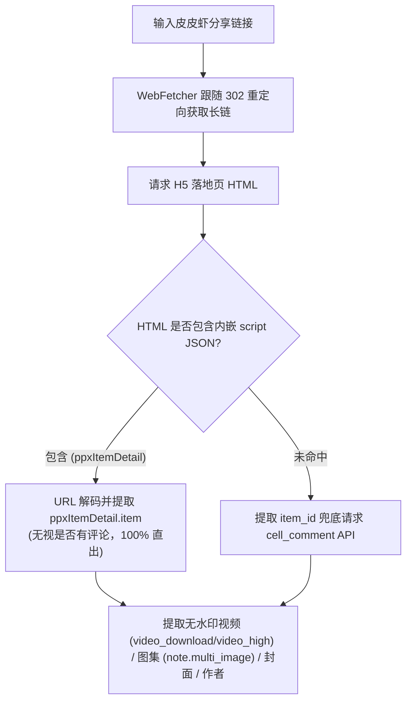

# 皮皮虾 (Pipixia) 逆向解析指南

本篇详细记录字节跳动旗下 **皮皮虾 (Pipixia)** 短视频与图文帖子的逆向提取方案、H5 数据注入解析与评论兜底机制。

---

## 1. 平台特征与支持能力

* **平台标识**：`皮皮虾`
* **支持媒体类型**：无水印视频 (MP4) / 图文图集 (多图) / 封面 / 标题文案 / 创作者信息
* **常见链接形态**：
  * App 短链接：`https://h5.pipix.com/s/YRvpWKIQgp0/`
  * 移动落地页长链：`https://h5.pipix.com/ppx/item/7685571425888901411`
  * 旧版落地页：`https://h5.pipix.com/item/6987123456789`
* **Cookie 依赖**：无需 Cookie。

---

## 2. 核心逆向流程与双轨容灾机制

皮皮虾采用 **H5 落地页内嵌 JSON 主路径 + 移动端评论 API 兜底** 的双轨高可用解析架构：



### 2.1 主路径：H5 落地页内嵌 JSON 提取 (推荐)
* **原理**：皮皮虾移动端分享页将完整的作品数据以 URL 编码格式注入在 `<script>` 标签内（包含 `ppxItemDetail.item` 与 `seoTDK`）。
* **核心优势**：
  * **解决无评论作品失效 Bug**：传统评论接口必须依赖帖子有评论才能提取作品主体，对于新发布或暂无评论的帖子，`cell_comments` 为空列表引发解析失败。而 H5 页面中始终包含完整的作品节点。
  * **原画无水印直链**：直接包含 `item.video.video_download.url_list`（官方原画无水印下载流）与 `item.note.multi_image`（高清多图图集）。

### 2.2 兜底路径：移动端 API 抓取
* **接口**：`https://api.pipix.com/bds/cell/cell_comment/`
* **参数**：`cell_id={cell_id}&cell_type=1&api_version=1&aid=1319&app_name=super`
* **直链映射**：
  * 视频流：`data.cell_comments[0].comment_info.item.video.video_high.url_list[0].url`
  * 图集：`data.cell_comments[0].comment_info.item.note.multi_image`

---

## 3. 测试与验证

* **单元测试**：[tests/test_pipixia_parser.py](file:///Users/leo/Projects/media-parser/tests/test_pipixia_parser.py)
* **执行命令**：
  ```bash
  python -m unittest tests/test_pipixia_parser.py
  ```

