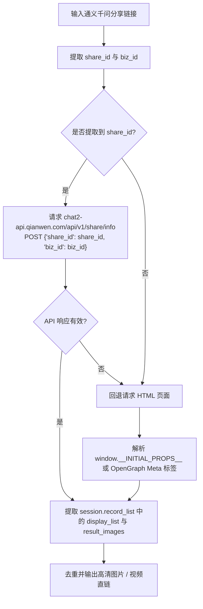

# 通义千问 (Qwen) 逆向解析指南

本篇详细记录阿里巴巴 **通义千问 (Qwen)** AI Studio、对话分享（Chat Share）及移动分享作品的 SPA API 与 SSR 数据提取方案。

---

## 1. 平台特征与支持能力

* **平台标识**：`通义千问`
* **支持媒体类型**：
  * AI 创作图集 / 扩图 / 文生图 / 对话生图 (PNG/JPEG/WEBP)
  * AI 生成视频 (MP4)
  * 提示词 Prompt、标题与作者信息
* **常见链接形态**：
  * 对话分享链接：`https://qianwen.my.cn/share/chat/84c5660504a44063bec11136615b9256?biz_id=ai_qwen`
  * AI Studio 移动分享长链：`https://activity.qianwen.com/r/ai-studio-mobile/qwen-external-share?shareId=ZeeOedXncnGlElkluRMA&authorId=OjTAcGHgZgye...`
* **Cookie 依赖**：公开外部分享**无需 Cookie**。

---

## 2. 核心逆向方案

通义千问分享落地页已升级为 React SPA 架构，解析器采用 **官方后端 API 优先 + HTML SSR 兜底** 的双重提取策略。



### 2.1 官方 SPA API 请求流程
* **接口**：`POST https://chat2-api.qianwen.com/api/v1/share/info?pr=qwen&fr=mac`
* **请求体**：`{"share_id": share_id, "biz_id": biz_id}`
* **响应解析**：
  * 从 `session.record_list` 提取对话生成的 `result_images` 与 `display_list`。

### 2.2 `__INITIAL_PROPS__` SSR 兜底流程
针对历史老版 AI Studio 页面（如 `activity.qianwen.com`）：
1. 定位 script 中的 `window.__INITIAL_PROPS__`。
2. 处理 URL 编码与嵌套 JSON 反序列化。
3. 提取 `images` 或 `resultList`。

---

## 3. 常见踩坑记录 (Gotchas)

1. **SPA 页面无静态 DOM**：
   * 新版 `qianwen.my.cn/share/chat/` 页面为纯客户端渲染，HTML 中无 `__INITIAL_PROPS__`，直接正则提取 HTML 会失败。必须调用 `chat2-api` 才能获取真实数据。
2. **`initialData` 双重编码**：
   * 老版前端模板将 `initialData` 做了 `encodeURIComponent`，在 `json.loads` 之前必须进行 `urllib.parse.unquote`。
3. **无水印原图 vs 带水印导出图 (`url` vs `downloadUrl`)**：
   * 在 `__INITIAL_PROPS__` 的 `images` / `image` 节点中，`url` 对应模型生成的 1024x1024 无水印原图，而 `downloadUrl` 对应网页端带右下角通义标识的导出图。解析器必须优先提取 `url`，以确保输出无水印纯净资源。

---

## 4. 测试与验证

* **单元测试**：[tests/test_qianwen_parser.py](file:///Users/leo/Projects/media-parser/tests/test_qianwen_parser.py)
* **执行测试**：
  ```bash
  pytest tests/test_qianwen_parser.py
  python tests/manual_verify_parsers.py --platform 通义千问
  ```
