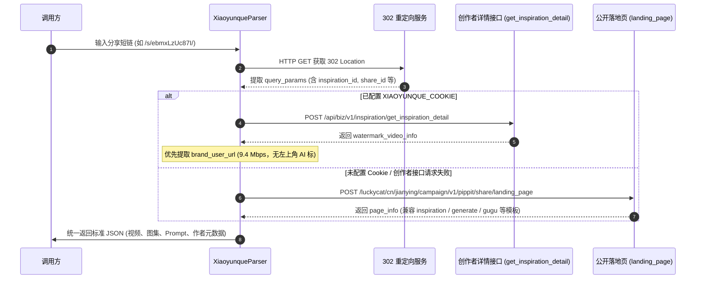

# 小云雀 AI (Xiaoyunque) 逆向解析指南

本篇详细记录字节跳动剪映旗下 **小云雀 AI (xiaoyunque.jianying.com / xyq.jianying.com)** 作品的接口抓取机制、底层 VOD 视频分发流、水印压制机制与双轨逆向解析算法。

---

## 1. 平台特征与支持能力

* **平台标识**：`小云雀AI`
* **支持媒体类型**：
  * **AI 生图 / 创作图集** (PNG/JPEG，100% 官方原始纯净无水印原图)
  * **AI 创作高清视频** (MP4，最高 9.4 Mbps 原画，支持去除左上角 AI 标识)
  * **提示词文案** (完整的 Prompt 提示词、标题、封面及创作者元数据)
* **常见链接形态**：
  * 分享短链：`https://xiaoyunque.jianying.com/s/ebmxLzUc87I/`
  * 落地页长链：`https://xiaoyunque.jianying.com/activities/pippit_share?inspiration_id=7647057288208977177&...`
* **Cookie 依赖**：公开短链**完全无需 Cookie** 即可匿名解析；配置 `XIAOYUNQUE_COOKIE` 可激活创作者超清去标通道。

> [!NOTE]
> **水印与素材状态说明**：
> 1. **AI 生图 / 图集**：从字节 TOS 存储桶中直接提取官方原始图（`origin_aigc`），**100% 完全无水印**。
> 2. **AI 生成视频**：平台在云端渲染合成时直接把水印压制在 MP4 画面像素中。解析器配置 Cookie 时自动优先提取已去除左上角「AI生成」黑框的 **9.4 Mbps 创作者原画流**（仅保留右下角小云雀微标）；公开免登录模式下自动回退至 H5 落地页通道。

---

## 2. 核心架构与双轨自适应解析流程



---

## 3. 视频流类型与底层逆向分析

小云雀视频采用字节跳动 VOD (Video On Demand) 视频云分发体系，服务端在完成视频生成后会产出多路物理文件：

| 视频流字段 / 类型 | 码率 / 分辨率 | 水印状态 | 解析器处理策略 |
| :--- | :---: | :--- | :--- |
| **`brand_user_url`** (创作者流) | **9.4 Mbps (720P/1080P)** | **无左上角「AI生成」黑框**，仅保留右下角微标 | **Cookie 模式下作为默认主视频 (`video_url`) 输出** |
| **`share_url`** (分享流) | ~9.4 Mbps | 左上角带「AI生成」框，右下角无标 | 备选流，放入 `video_list` |
| **`download_url` / `brand_url`** | ~9.4 Mbps | 左上角「AI生成」+ 右下角「小云雀」双水印 | 备选流，放入 `video_list` |
| **`ai_url`** (预览流) | ~6.4 Mbps (720P) | 带官方基础预览水印 | 免登录兜底流 |
| **母带原始渲染流** (如 `7cef...`) | 原画 | 100% 纯净（无任何角标） | **受作者账号 UID 权限保护**（见下文说明） |

### 底层母带权限边界分析 (UID Security Boundary)
通过对 Web 前端源码（`main.e10fbb27b2.js`）及后端 RPC 服务逆向发现：
* 原始 100% 纯净母带渲染任务（`videogen/batch_get_render_task` / `get_published_inspiration_detail`）在后端 RPC 微服务（`pippit.business.editor`）层面进行了严格的用户归属鉴权：
  ```json
  {"ret":"10007","errmsg":"RPCError{PSM:[pippit.business.editor] Method:[CheckRenderTask] BizStatusMessage:[uid not equal]}"}
  {"ret":"2","errmsg":"uid not own inspiration"}
  ```
* **结论**：普通访客或跨账号请求无法直接获取母带播放签名。解析器通过 `get_inspiration_detail` 提取的 `brand_user_url` 是当前非作者本号跨端获取的最佳清晰度与最少水印版本。

---

## 4. 接口规范与参数清洗

### 4.1 创作者灵感详情接口（优先，需 Cookie）
* **接口地址**：
  `POST https://xyq.jianying.com/api/biz/v1/inspiration/get_inspiration_detail`
* **请求头**：
  ```http
  Accept: application/json, text/plain, */*
  Content-Type: application/json
  Appid: 795647
  pf: 7
  appvr: 5.8.0
  Cookie: <XIAOYUNQUE_COOKIE>
  ```
* **请求体**：
  ```json
  {
    "inspiration_id_list": ["7647057288208977177"]
  }
  ```
* **核心字段提取**：
  * `data.inspiration_list[0].prompt`：完整 Prompt 提示词。
  * `data.inspiration_list[0].watermark_video_info.brand_user_url`：无左上角 AI 标原画视频。
  * `data.inspiration_list[0].watermark_image_info`：高清图片。

### 4.2 公开落地页接口（兜底，免 Cookie）
* **接口地址**：
  `POST https://xiaoyunque.jianying.com/luckycat/cn/jianying/campaign/v1/pippit/share/landing_page`
* **模板多态兼容**：
  * `inspiration_page`：灵感与同款生成；
  * `generate_page`：生图与生视频页面；
  * `template_page`：官方创意模板；
  * `gugu_page`：接龙片单与短剧播放列表（按 `current_index` 索引）。
* **图集无水印提取**：从 `item_info.image_info[].image_url` 中直接获取 `~tplv-wipe09lpyt-origin_aigc.image` 原图。

---

## 5. 测试与验证

* **单元测试**：[tests/test_xiaoyunque_parser.py](file:///Users/leo/Projects/media-parser/tests/test_xiaoyunque_parser.py)
* **执行测试**：
  ```bash
  python -m unittest tests/test_xiaoyunque_parser.py
  python -m unittest discover tests/
  ```
