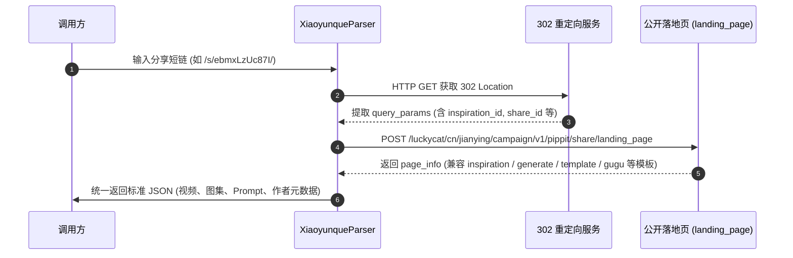

# 小云雀 AI (Xiaoyunque) 逆向解析指南

本篇详细记录字节跳动剪映旗下 **小云雀 AI (xiaoyunque.jianying.com / xyq.jianying.com)** 作品的接口抓取机制、底层 VOD 视频分发流、水印压制机制与免登录逆向解析算法。

---

## 1. 平台特征与支持能力

* **平台标识**：`小云雀AI`
* **支持媒体类型**：
  * **AI 生图 / 创作图集** (PNG/JPEG，100% 官方原始纯净无水印原图)
  * **AI 创作高清视频** (MP4 高清播放流与备选流列表)
  * **提示词文案** (完整的 Prompt 提示词、标题、封面及创作者元数据)
* **常见链接形态**：
  * 分享短链：`https://xiaoyunque.jianying.com/s/ebmxLzUc87I/`
  * 落地页长链：`https://xiaoyunque.jianying.com/activities/pippit_share?inspiration_id=7647057288208977177&...`
* **Cookie 依赖**：**完全无需 Cookie**，全匿名免登录解析。

> [!NOTE]
> **水印与素材状态说明**：
> 1. **AI 生图 / 图集**：从字节 TOS 存储桶中直接提取官方原始图（`origin_aigc`），**100% 完全无水印**。
> 2. **AI 生成视频**：平台在云端渲染合成时直接把水印压制在 MP4 画面像素中。解析器通过公开落地页通道直接提取高清视频播放流与备选流列表。视频封面也带有水印，为压水印视频的抽帧截图。

---

## 2. 核心架构与解析流程



---

## 3. 接口规范与参数清洗

### 公开落地页接口（免 Cookie）
* **接口地址**：
  `POST https://xiaoyunque.jianying.com/luckycat/cn/jianying/campaign/v1/pippit/share/landing_page`
* **模板多态兼容**：
  * `inspiration_page`：灵感与同款生成；
  * `generate_page`：生图与生视频页面；
  * `template_page`：官方创意模板；
  * `gugu_page`：接龙片单与短剧播放列表（按 `current_index` 索引）。
* **图集无水印提取**：从 `item_info.image_info[].image_url` 中直接获取 `~tplv-wipe09lpyt-origin_aigc.image` 原图。

---

## 4. 测试与验证

* **单元测试**：[tests/test_xiaoyunque_parser.py](file:///Users/leo/Projects/media-parser/tests/test_xiaoyunque_parser.py)
* **执行测试**：
  ```bash
  python -m unittest tests/test_xiaoyunque_parser.py
  python -m unittest discover tests/
  ```
